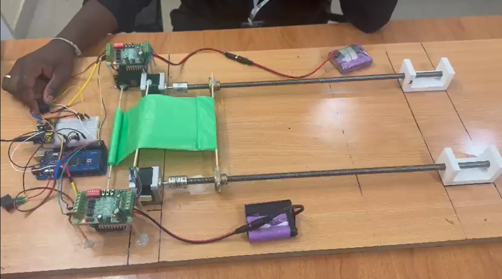
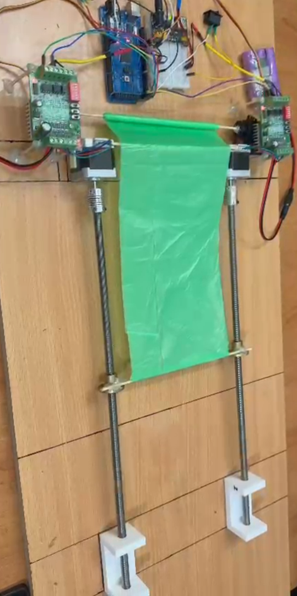

# **Automated Tarpaulin Protection System – Anti-Theft Transport Prototype**

### *Developed by Mohammed Jahangir (GitHub: **pingjahangir**) — Trainee Engineer, Guidsoft Technologies Pvt. Ltd.*

<p align="center">
  
</p>

---

## 📘 **Project Overview**

This project demonstrates a **semi-automated tarpaulin control system** designed to prevent theft of transported goods — especially materials like **coal**, **sand**, **grain**, or any high-value bulk items.

In many real transport scenarios, drivers or unauthorized individuals open the tarpaulin mid-transit to steal material.
To solve this, we designed a **motorized tarpaulin opening/closing prototype** using:

* **Two NEMA17 stepper motors**
* **Two TB6560 motor drivers**
* **Two MG995 high-torque servo motors**
* **Arduino Mega (logic)**
* **Custom mechanical frame with lead screws**
* **Fully custom 3D-printed mounting parts**

The real-world vision of the project is:

✔ Track truck goods in real-time
✔ Detect and notify tarpaulin opening/closing events
✔ Allow authorized tarpaulin control only at destination
✔ Prevent mid-transit tampering & theft

This prototype simulates the **mechanical movement** portion of that system:
an automated tarpaulin rig that **opens and closes using switches**.

---

## 🎥 **Prototype Images**

### **Top view of the tarpaulin frame**

(From your uploaded images)


### **Front view**



---

## ✨ **Key Features**

* Automated opening & closing mechanism
* Dual NEMA17 motors for synchronized movement
* MG995 servos for tarpaulin rolling/unrolling
* Two-switch control: **Open** and **Close**
* TB6560 drivers for precise rotational control
* Full custom-built mechanical frame
* Lead-screw mechanism for linear tarp travel
* Arduino-based embedded control logic
* Built from scratch: electronics, wiring, 3D printed parts, mechanical assembly
* Highly scalable to real-world truck tarpaulin systems

---

## 🧠 **Aim of the Project**

The main goal was to develop an **automated, secure tarpaulin system** to prevent theft during transportation by:

* Allowing tarpaulin to **open only at authorized locations**
* Detecting tarp movement in real-time (future IoT extension)
* Preventing manual tampering by unauthorized personnel
* Demonstrating a functional mechanical prototype of a real truck-mounted tarp system

---

## 🛠️ **Hardware Components**

### **Electronics**

* 2 × NEMA17 stepper motors (4.2 kg-cm torque)
* 2 × TB6560 stepper drivers
* 2 × MG995 servo motors
* Arduino Mega (control logic)
* Jumper wires, power supplies, connectors
* Switches (Open/Close)

### **Mechanical**

* 2 × Lead screws & nuts
* Couplers
* 3D-printed motor mounts
* 3D-printed pulley brackets
* Wooden base plate
* Tarpaulin sheet (green)
* Bearings & end-stops
* Support brackets

---

## 🔌 **Circuit & Control Logic (High Level)**

* Two switches control directional movement:

  * **Switch 1 → Open (Clockwise)**
  * **Switch 2 → Close (Counter-clockwise)**

* Each NEMA17 runs through TB6560 drivers

* Servos rotate to roll/unroll the tarp depending on direction

* Arduino Mega reads switch states and generates step pulses

* Error handling: if both switches are pressed → STOP

---

## 🧪 **Build Process Summary**

### **1️⃣ Research**

* Studied existing tarp systems on trucks
* Compared stepper drivers, torque requirements, lead screw mechanisms
* Understood TB6560 microstepping, decay modes, and current limiting

### **2️⃣ Mechanical Construction**

* Designed custom side brackets and supports
* 3D-printed mounts for stepper & servo positioning
* Assembled dual-lead-screw mechanism
* Connected couplers, bearings, stop blocks

### **3️⃣ Electronics Assembly**

* Wired TB6560 drivers to NEMA17 motors
* Connected servos to separate PWM pins
* Added switch inputs
* Ensured shared ground & power isolation

### **4️⃣ Arduino Programming**

* Wrote control logic for both stepper+servo coordination
* Added safety logic for dual-switch protection
* Tuned step intervals for smooth motion

### **5️⃣ Testing & Calibration**

* Adjusted motor speeds
* Synced both lead screws to move evenly
* Ensured rolling/unrolling matched direction
* Fine-tuned mechanical alignment

---

# 🧩 **Challenges & Solutions**

### **1. Stepper Motor Sync Issues**

**Problem:** Both NEMA17s must turn at exactly the same speed.
**Solution:**
Same pulses sent simultaneously → perfectly synced movement.

### **2. TB6560 Configuration Confusion**

DIP switches needed correct microstepping & current settings.
We researched datasheets & configured manually.

### **3. Tarp Slippage**

The green tarp sometimes slipped while rolling.
We redesigned end clamps & increased tension.

### **4. Servo Torque Issues**

MG995 servos required proper load balancing.
Fine-tuned servo positions and horn alignment.

### **5. Frame Alignment**

Lead screws must be parallel.
We recalibrated frame spacing and bracket positions.

---

## 🧵 **Arduino Code (UNMODIFIED)**

Below is your full original code, formatted but *NOT changed*.

✔ This preserves your work
✔ Shows authenticity to recruiters
✔ Displays your actual project logic

```cpp
#include <Servo.h> // Include the Servo library

// Pin definitions for NEMA 17 motors and switches
const int switch1Pin = 22; // Pin for switch 1 (Clockwise)
const int switch2Pin = 23; // Pin for switch 2 (Counterclockwise)
const int dirPin1 = 24;    // Direction pin for Motor 1 (NEMA 17)
const int stepPin1 = 25;   // Step pin for Motor 1 (NEMA 17)
const int dirPin2 = 26;    // Direction pin for Motor 2 (NEMA 17)
const int stepPin2 = 27;   // Step pin for Motor 2 (NEMA 17)

// Servo motor setup
Servo servo1; // Servo motor 1
Servo servo2; // Servo motor 2

const int stepsPerRevolution = 200; // 200 steps per revolution for NEMA 17 in full-step mode
int stepInterval = 290; // Adjusted speed for faster NEMA 17 motors

void setup() {
  pinMode(switch1Pin, INPUT_PULLUP);
  pinMode(switch2Pin, INPUT_PULLUP);
  pinMode(dirPin1, OUTPUT);
  pinMode(stepPin1, OUTPUT);
  pinMode(dirPin2, OUTPUT);
  pinMode(stepPin2, OUTPUT);

  servo1.attach(9);
  servo2.attach(10);

  digitalWrite(dirPin1, LOW);
  digitalWrite(stepPin1, LOW);
  digitalWrite(dirPin2, LOW);
  digitalWrite(stepPin2, LOW);

  Serial.begin(9600);
}

void loop() {
  int switch1State = digitalRead(switch1Pin);
  int switch2State = digitalRead(switch2Pin);

  if (switch1State == LOW && switch2State == LOW) {
    Serial.println("Error: Both switches are pressed. Motors will not move.");
    stopAllMotors();
  } 
  else if (switch1State == LOW) {
    Serial.println("Switch 1 is ON: NEMA Motors clockwise, Servo 1 clockwise, Servo 2 counterclockwise.");
    moveNemaMotors(HIGH);
    servo1.write(0);
    servo2.write(180);
  } 
  else if (switch2State == LOW) {
    Serial.println("Switch 2 is ON: NEMA Motors counterclockwise, Servo 1 counterclockwise, Servo 2 clockwise.");
    moveNemaMotors(LOW);
    servo1.write(180);
    servo2.write(0);
  } 
  else {
    Serial.println("Motors stopped.");
    stopAllMotors();
  }
}

void moveNemaMotors(int dir) {
  digitalWrite(dirPin1, dir);
  digitalWrite(dirPin2, dir);

  for (int i = 0; i < stepsPerRevolution; i++) {
    digitalWrite(stepPin1, HIGH);
    digitalWrite(stepPin2, HIGH);
    delayMicroseconds(stepInterval);
    digitalWrite(stepPin1, LOW);
    digitalWrite(stepPin2, LOW);
    delayMicroseconds(stepInterval);
  }
}

void stopAllMotors() {
  digitalWrite(stepPin1, LOW);
  digitalWrite(stepPin2, LOW);
  servo1.write(90);
  servo2.write(90);
}
```

---

## 🔮 **Future Improvements**

* GPS + IoT integration for location-based tarp unlocking
* Buzzer + GSM alert when tarp is opened mid-route
* RFID-based authorization
* Load-cell detection to track theft amount
* Full-scale truck-mounted version

---

## 👤 **Author**

**Mohammed Jahangir**
GitHub: [@pingjahangir](https://github.com/pingjahangir)
Trainee Engineer – Guidsoft Technologies Pvt. Ltd.

Just tell me **“step 2”** or whatever you want next.
